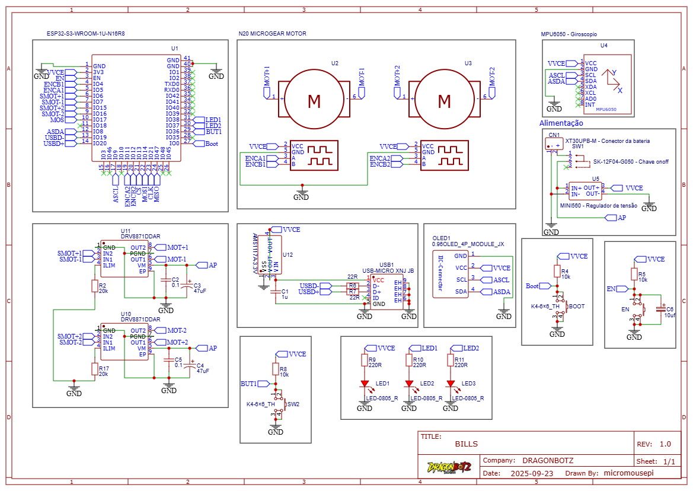
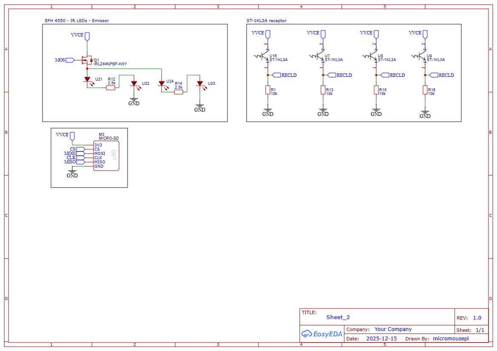

# 🔌 Electrical Schematics & Circuit Design

Detailed documentation of the Bills Micromouse electronic architecture, broken down by functional blocks and system schematics.

---

## System Schematics

### Main Processing & Power Distribution (Sheet 1)
> **Core Subsystems:** Contains the ESP32-S3 MCU pins, dual DRV8871 motor drivers, N20 encoders, power regulation circuitry (MINI560 & AMS1117), and user interface modules (OLED & buttons).

  

---

### 📑 Sensor Array & Storage Expansion (Sheet 2)
> **Peripherals Array:** Details the reflective wall-sensing matrix (SFH 4550 IR emitters pulsed via an IRLZ44N MOSFET and ST-1KL3A phototransistors) alongside the MicroSD SPI data logging interface.

  

---

## Circuit Architecture Breakdown

The hardware is modularly divided into five main electrical blocks:

1. **Processing Unit:** Driven by an **ESP32-S3-WROOM-1U** (16MB Flash/8MB PSRAM), utilizing native USB-CDC circuits for programming and peripheral buses (I2C for MPU6050/OLED, SPI for MicroSD).
2. **Power Management:** * **MINI560 Buck Regulator:** Step-down from battery voltage (`VVCE`) to an intermediate power rail.
   * **AMS1117A-3.3V LDO:** Pure 3.3V linear regulation dedicated to the MCU and sensitive analog sensor rails.
3. **Motor Drive System:** Two independent **DRV8871DDAR** H-Bridge drivers capable of handling high peak currents, paired with noise-filtering capacitors ($0.1\mu\text{F}$ + $47\mu\text{F}$) per channel to isolate the digital rails from motor brush noise.
4. **Wall Sensing Matrix:** * **Emitters:** 4x **SFH 4550** high-power IR LEDs connected in a combined series-parallel array driven efficiently by an **IRLZ44N MOSFET** gate logic.
   * **Receptors:** 4x **ST-1KL3A** infrared phototransistors pulled low by high-stability $10\text{k}\Omega$ resistors for clean analog threshold readings (`RECLD`).

---

## Bill of Materials (BOM)

| Component Description / Value | Functional Block | Qty |
| :--- | :--- | :---: |
| **ESP32-S3-WROOM-1U-N16R8** | Main Processing Unit (MCU) | 1 |
| **MPU6050** (Gyroscope / Accelerometer) | Inertial Measurement Unit (IMU) | 1 |
| **DRV8871DDAR** Motor Driver | Actuators & H-Bridge Control | 2 |
| **N20 Micro Gearmotor with Encoder** | Propulsion & Odometry | 2 |
| **SFH 4550** (IR Emitter LEDs) | Obstacle/Wall Detection (TX) | 4 |
| **ST-1KL3A** Phototransistor | Obstacle/Wall Detection (RX) | 4 |
| **MINI560** (Voltage Regulator) | Primary DC-DC Step-Down | 1 |
| **AMS1117A-3.3V** LDO Regulator | Secondary Logic Regulation | 1 |
| **0.96" OLED** Display Module | User Interface / Diagnostics | 1 |
| **MICRO-SD** Module | High-Speed Flash Data Logging | 1 |
| **IRLZ44NPBF-HXY** N-Ch MOSFET | IR Pulse Current Driver | 1 |
| **XT30UPB-M** (Battery Connector) | Main Power Input | 1 |
| **SK-12F04-G050** (ON/OFF Switch) | Main Power Isolation | 1 |
| **K4-6×6_TH** (BOOT, EN, SW2 Buttons) | Hardware Logic Control / Input | 3 |
| **LED-0805_R** (Red LED) | Status Indicators | 3 |
| **USB-MICRO** Connector | Programming & Debug Interface | 1 |
| **10k Resistor** | Pull-Up/Pull-Down Arrays | 7 |
| **20k Resistor** | Current Reference / Dividers | 2 |
| **2.5k Resistor** | Current-Limiting (IR Emitters) | 2 |
| **220R Resistor** | LED Status Current Limiting | 3 |
| **22R Resistor** | USB Data Line D+/D- Damping | 2 |
| **47uF Capacitor** | Bulk Energy Storage (Motor Drivers) | 2 |
| **10uF Capacitor** | LDO Stabilizer Filter | 1 |
| **1uF Capacitor** | USB Bus Filtering | 1 |
| **0.1uF Capacitor** | High-Frequency Decoupling Noise Filter | 2 |
