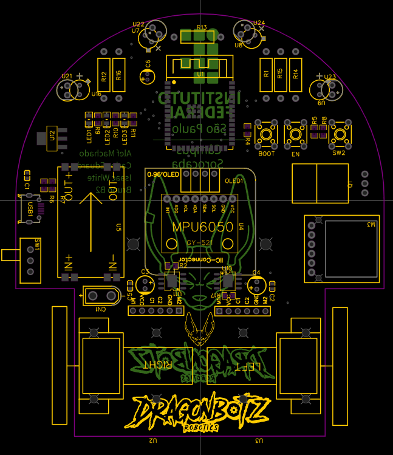
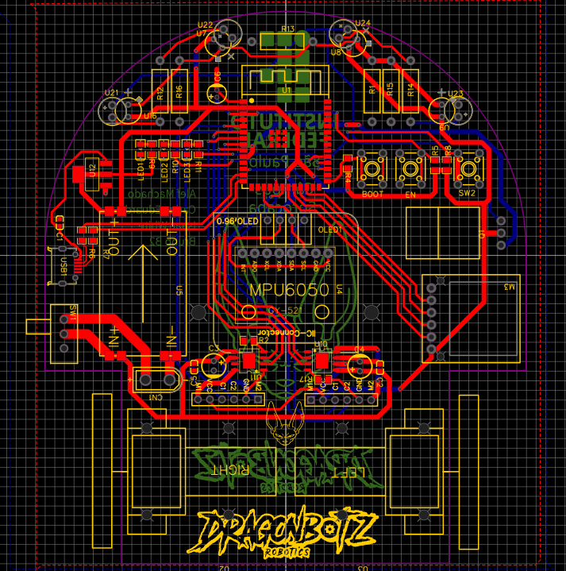

# PCB Design & Hardware Architecture

A clear and organized documentation of the hardware development for the Bills robot.

---

##  Overview

In this section, I present the evolution of the printed circuit board (PCB) designed for the micromouse robot. The focus was on track optimization and the strategic placement of core components, such as the MPU6050 sensor.

---

##  Design Evolution

### 1️⃣ First Prototype (First Design)
> **Initial Approach:** In the first design, I implemented a full **ground plane** method across the board and tried to keep the traces as straight and parallel as possible to prevent signal noise in the sensor readings.

  

---

### Updated Version (Final Look)
> **Improvements Made:** For the new version, I updated the visual aesthetic of the board and positioned the **MPU6050 sensor exactly at the geometric center** of the robot. This drastically improves the accuracy of turn readings and keeps the robot highly stable while navigating the maze.

  

---

##  Key Hardware Features
* **Centralized Gyro/Accelerometer:** MPU6050 positioned directly on the rotation axis.
* **Optimized Ground Plane:** Drastic reduction of electromagnetic interference (EMI) on signal traces.
* **Connectivity:** Ready for seamless integration with the microcontroller and wall-detection sensors.
