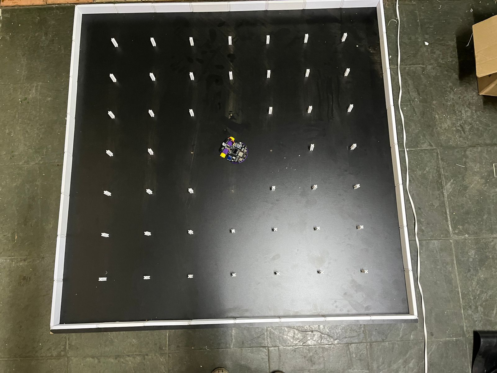
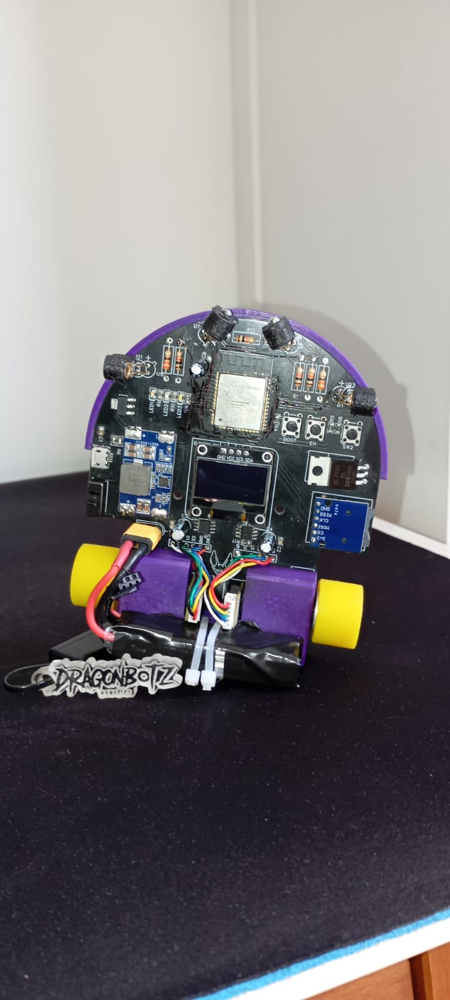
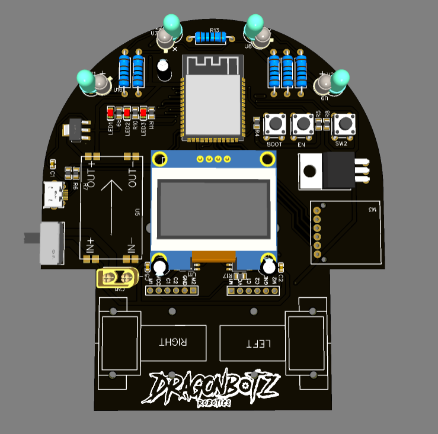

# Bills

Bills is a micromouse robot designed to solve mazes using logic and matrix-based algorithms.

---

"

## Features

- Autonomous maze solving
- Matrix-based pathfinding
- Wall detection sensors
- Motor control system
- Optimized movement logic

---

## Project Structure

This project is divided into stages:

- PCB design
- Electrical schematics
- Firmware development
- Sensor integration
- Navigation algorithms
- Testing and calibration

---

## Hardware

### Components Used and PCB

- Microcontroller
- IR sensors
- Motor drivers
- DC motors
- Encoders

---

## Maze Solving Logic
In the simulation, Bills creates a logic that reads the remaining path and follows it towards the center.
--- 
## 📷 Galeria do Projeto

